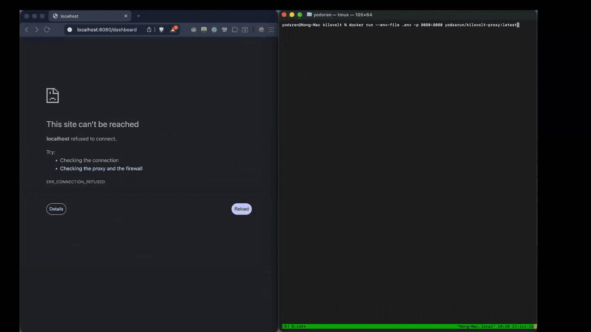

# Kilovolt (kvlt) ⚡

🚀 **Want a hosted version? [Join the Kilovolt Cloud Waitlist](https://kilovolt.vercel.app/).**

[](https://www.rust-lang.org) [](https://opensource.org/licenses/MIT)

**Kilovolt (kvlt)** is a hyper-optimized, high-throughput asynchronous reverse proxy designed to act as a **Bankruptcy Shield** for independent developers, startups, and coding agents running AI applications on low-resource hardware.

*(The Kilovolt v1.2.0 Telemetry Dashboard: Monitoring memory footprint and real-time API spend.)*

## 💡 Why Kilovolt? (The "Bleeding Neck" Problem)

When running high-volume LLM pipelines or autonomous agents, relying on the provider's built-in global rate limits is not enough. A single unchecked `while` loop during local development, or a rogue downstream client spamming your endpoint, can burn thousands of dollars overnight.

Furthermore, standard enterprise API gateways often buffer large token streams entirely into memory before forwarding them. On a $5/month VPS, this rapidly consumes the server's heap space, resulting in catastrophic Out-of-Memory (OOM) crashes.

**Kilovolt solves this by operating as a highly performant financial circuit breaker:**

1. **Zero-Memory Bloat:** It intercepts OpenAI-compatible API traffic and pipes the streaming tokens back to client applications with a strictly flat, non-expanding memory footprint ($O(1)$ space complexity).
2. **Hard-Cut Budget Enforcement:** It calculates token costs mid-stream and cuts the TCP connection the exact millisecond a user breaches their budget—stopping runway burn dead in its tracks.



## 🚀 Core Features

- **Zero-Copy Stream Piping**: Pipes byte-chunks from OpenAI's SSE (`text/event-stream`) directly to client sockets. The gateway's memory footprint remains flat regardless of the size or duration of the chat stream.
- **Pre-Flight Prompt Validation**: Inspects incoming payloads, calculates prompt tokens using tiktoken BPE, projects the USD cost, and rejects requests with `429 Too Many Requests` if the user is over budget.
- **Multi-Tier Token Budgets**: Supports per-step prompt checks, per-pipeline stuck-loop guards, and per-day token safety caps.
- **Mid-Stream Circuit Breaker**: Actively parses streaming SSE chunks to count output tokens on the fly. The exact millisecond the cumulative spend exceeds the budget limit, it severs the TCP connection.
- **Upstream Refund Guard**: If an upstream connection fails or returns an error response, the pre-flight prompt cost is automatically refunded to the user's spend ledger.
- **Connection Abortion**: Monitors downstream client sockets. If a client terminates a request early, Kilovolt instantly drops the upstream socket, canceling downstream transmission and preventing "ghost token" billing.
- **Native Telemetry Dashboard:** Includes a zero-dependency HTML/Tailwind dashboard served on `/dashboard` to visualize active agents, memory footprint, and transaction costs in real-time.

## 🔌 Supported Providers & LLM Engines

Kilovolt acts as a zero-copy byte pipeline, streaming payloads without parsing the main chat JSON structure. This makes it natively compatible with **any hosted provider or local engine using the standard OpenAI-compatible wire format (`/v1/chat/completions`)**:

### Hosted Cloud Providers

- **OpenAI** (Official APIs — Default upstream destination)
- **DeepSeek** (100% OpenAI-compatible endpoints)
- **Groq** / **Together AI** / **OpenRouter** / **Fireworks AI**

### Self-Hosted / Local LLM Engines

- **Ollama** (exposes OpenAI compatible endpoint on port `11434`)
- **vLLM** / **llama.cpp** (built-in server)
- **LM Studio** / **LocalAI**

## 📦 Quickstart (Under 60 Seconds)

Deploy the Bankruptcy Shield gateway instantly with zero local dependencies.

### 1. Configure Settings

Create a `.env` file in your project directory.

```env
KILOVOLT_PORT=8080
KILOVOLT_DEFAULT_BUDGET=5.00
RUST_LOG=kilovolt=info
```

### 2. Launch the Gateway

Expose the proxy and mount your configuration using Docker.

```bash
docker run -d --env-file .env -p 8080:8080 yodsarun/kilovolt-proxy:latest
```

## 🔌 API Integration (Drop-In Replacement)

To route traffic through the Bankruptcy Shield, simply redirect your client library's base URL to Kilovolt and append the custom identity header `X-User-ID`. **No code rewrites required.**

### Python (OpenAI SDK)

```python
import os
from openai import OpenAI

client = OpenAI(
    api_key=os.environ.get("OPENAI_API_KEY", "your-api-key"),
    base_url="http://127.0.0.1:8080/v1" # Point to local Kilovolt instance
)

try:
    response = client.chat.completions.create(
        model="gpt-4o",
        messages=[{"role": "user", "content": "Explain async streams."}],
        stream=True,
        extra_headers={"X-User-ID": "developer_1"} # Track spend against this ID
    )
    for chunk in response:
        content = chunk.choices[0].delta.content
        if content:
            print(content, end="", flush=True)
except Exception as e:
    print(f"\nAPI Error: {e}")
```

### Node.js (OpenAI SDK)

```js
const { OpenAI } = require('openai');

const openai = new OpenAI({
  apiKey: process.env.OPENAI_API_KEY || 'your-api-key',
  baseURL: 'http://127.0.0.1:8080/v1', // Point to local Kilovolt instance
});

async function main() {
  try {
    const stream = await openai.chat.completions.create({
      model: 'gpt-4o',
      messages: [{ role: 'user', content: 'What is zero-copy stream piping?' }],
      stream: true,
    }, {
      headers: { 'X-User-ID': 'developer_1' } // Track spend against this ID
    });

    for await (const chunk of stream) {
      process.stdout.write(chunk.choices[0]?.delta?.content || '');
    }
  } catch (err) {
    console.error('\nAPI Failed:', err.message);
  }
}
main();
```

## 🛑 Token Budgets (Enforcement Gates)

Kilovolt supports multi-tier token budgeting to protect your LLM workflows from infinite loops, prompt bloat, and runaway credit card bills.

### Configuration

Add the following environment variables to your `.env` file to configure limits:

```env
# Worst-case token consumption estimate per request step
KILOVOLT_PER_STEP_TOKENS=2048

# Maximum tokens allowed inside a single pipeline run (stuck-loop guard)
KILOVOLT_PER_PIPELINE_TOKENS=10000

# Daily token ceiling across all runs and clients (resets at server-midnight)
KILOVOLT_PER_DAY_TOKENS=100000
```

### Routing & Pipeline Context Headers

Clients can specify execution context in headers to associate requests under specific pipelines and steps:
* `X-Pipeline-ID`: Unique ID for the active pipeline run (aggregates token counts across multiple requests).
* `X-Pipeline-Name`: Human-readable name of the pipeline (used in logs).
* `X-Step-Name`: Human-readable name of the active step.

Example cased warning output logged on budget breaches:
```text
[pipeline:Alpha][step:Summarize] BUDGET_BLOCKED: daily token limit 100000 would be exceeded (used: 98500, requested: 2048)
```

## 🗺️ Future Roadmap

- **Phase 3 Protocol Expansion:** Adding native support for Anthropic Claude and Google Gemini wire formats.
- **Automated CI/CD Pipeline**: Transitioning from manual Docker Hub releases to a zero-touch GitHub Actions architecture.

## 📄 License

This project is licensed under the MIT License - see the LICENSE file for details.
