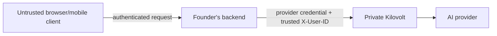

# Kilovolt

Kilovolt is a self-hosted Rust gateway placed between an application's trusted
backend and an upstream chat-completions provider. It enforces a process-local
calculated-spend limit for the whole application project and a default limit for
each trusted `X-User-ID`.

Kilovolt addresses a narrow problem: stop forwarding a request when the next
calculated prompt or supported output increment would exceed either configured
budget. It complements provider-side limits and alerts; it is not an exact
provider invoice or a guarantee against every unexpected bill.

## Current maturity

Implemented and tested:

- atomic project and per-user prompt reservations and output charges;
- bounded OpenAI-compatible SSE reconstruction across arbitrary byte chunks;
- bounded non-streaming JSON responses with usage/fallback accounting;
- failure and cancellation-aware prompt lifecycle;
- request, upstream-body, and SSE-frame limits;
- authenticated local customer dashboard;
- company telemetry disabled by default;
- deterministic concurrency, integration, and benchmark harnesses.

Experimental:

- streaming Gemini request/response translation;
- compatibility with a custom OpenAI-like upstream URL, which must be verified
  against the specific provider and version;
- optional pipeline/day token gates, whose check/update lifecycle is weaker
  under concurrency than the financial ledger.

Known limitations:

- all ledgers are in memory, reset on restart, and are independent per process;
- money uses `f64`;
- built-in prices were not independently verified in this offline Phase 3 run
  and may be stale;
- streaming text is tokenized per SSE event, so it is a bounded conservative
  approximation rather than whole-answer/provider billing equivalence;
- tool/function-call-only output is not fully accounted;
- no proxy-route end-user authentication, rate limiting, or distributed
  consistency is implemented.

## Supported routes

| Route | Behavior |
|---|---|
| `POST /v1/chat/completions` | OpenAI-shaped streaming and non-streaming requests. Non-Gemini traffic uses the configured OpenAI upstream URL. |
| `GET /health` | Public liveness response: `OK`. |
| `GET /dashboard` | Authenticated local customer dashboard. |
| `GET /api/stats` | Authenticated local JSON statistics. |
| `POST /mock/v1/chat/completions` | Deterministic local test/benchmark upstream; do not expose publicly. |

Gemini models are translated only when `stream=true`. Other provider families
and API routes are not claimed.

## Quickstart

```bash
cargo build --release

export BIND_ADDR=127.0.0.1
export KILOVOLT_PORT=8080
export KILOVOLT_PROJECT_BUDGET=25.00
export KILOVOLT_DEFAULT_BUDGET=5.00
export KILOVOLT_DASHBOARD_TOKEN="$(openssl rand -hex 32)"
export KILOVOLT_TELEMETRY_ENABLED=false

./target/release/kilovolt
```

Test through the deterministic mock without a real provider key:

```bash
curl --no-buffer --fail \
  -H 'Authorization: Bearer mock-key' \
  -H 'Content-Type: application/json' \
  -H 'X-User-ID: local-test-user' \
  -H 'X-Mock-Upstream: true' \
  --data '{
    "model":"gpt-4o-mini",
    "messages":[{"role":"user","content":"Hello"}],
    "stream":true
  }' \
  http://127.0.0.1:8080/v1/chat/completions
```

## Safe deployment boundary


```mermaid
flowchart LR
    C["Untrusted browser/mobile client"] -->|"authenticated request"| B["Founder's backend"]
    B -->|"provider credential + trusted X-User-ID"| K["Private Kilovolt"]
    K --> P["AI provider"]
```

`X-User-ID` must be inserted by the authenticated founder backend. Never let an
untrusted browser or mobile client choose it directly; rotating the value would
bypass per-user accounting.

## Project and per-user budgets

```bash
# One deployment-wide application limit
export KILOVOLT_PROJECT_BUDGET=100.00
# Backward-compatible default applied to each distinct X-User-ID
export KILOVOLT_DEFAULT_BUDGET=5.00
```

Every prompt reservation and output charge checks both levels under one ledger
lock. A failed check leaves both unchanged. If the project variable is omitted,
it falls back to `KILOVOLT_DEFAULT_BUDGET`.

## Dashboard

Open `http://127.0.0.1:8080/dashboard`. For the browser's HTTP Basic prompt, use
username `kilovolt` and `KILOVOLT_DASHBOARD_TOKEN` as the password.

```bash
curl --user "kilovolt:${KILOVOLT_DASHBOARD_TOKEN}" \
  http://127.0.0.1:8080/api/stats
```

Without the token configuration, both routes return `503`. Use TLS and private
network exposure outside localhost.

## Telemetry

Company telemetry is disabled by default:

```bash
export KILOVOLT_TELEMETRY_ENABLED=false
```

Explicit opt-in sends the documented startup, 24-hour process aggregates, and
per-recorded-request calculated-cost payloads to `KILOVOLT_TELEMETRY_URL`.
Customer dashboard data remains local and uses a separate data path. See
[telemetry.md](docs/telemetry.md) for exact fields and privacy implications.

## Verified benchmark snapshot

Three post-fix local runs used an Apple M4, 16 GiB RAM, macOS arm64, release
build, and a loopback deterministic mock. Idle RSS ranged from 10,208–10,256
KiB; tokenizer-active normal workloads reached about 61.5–64.5 MiB; a 512 KiB
prompt peaked at about 93.4–93.6 MiB. Sub-millisecond paired streaming TTFB
differences changed sign across repetitions and are reported as scheduler
noise. A 5,000-event proxied stream added 18.572–18.772 ms p50 end-to-end versus
the direct local mock.

These are one-machine results, not universal guarantees. The raw evidence,
methodology, measurement noise, and a benchmark-discovered tokenizer-cloning
fix are in [benchmarks.md](docs/benchmarks.md). No Go/Python gateway comparison
was performed.

## Documentation

- [Architecture and lifecycle](docs/architecture.md)
- [Security and threat model](docs/security.md)
- [Configuration reference](docs/configuration.md)
- [Telemetry fields and controls](docs/telemetry.md)
- [Benchmarks and raw evidence](docs/benchmarks.md)
- [Production checklist](docs/production-checklist.md)
- [Cookbook](docs/cookbook/README.md)
- [API details](docs/api_usage.md)
