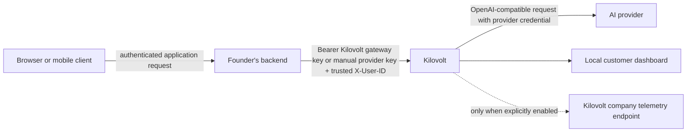

# Architecture

Kilovolt is a single-process reverse proxy between an authenticated application
backend and an upstream chat-completions provider. One self-hosted process is one
implicit application project.

## Trust and request flow

The founder's backend is the identity boundary. Kilovolt does not authenticate
end users and must not accept an arbitrary `X-User-ID` directly from an
untrusted browser or mobile client.

## Proxy lifecycle

1. Require completed setup in browser evaluation mode, validate its generated
   bearer gateway key, and substitute the in-memory provider key. Configured
   manual mode instead validates optional `X-Kilovolt-Key` and forwards the
   provider bearer credential. Authentication happens before body parsing or a
   budget reservation; both paths then validate `Content-Type`.
2. Read at most `KILOVOLT_MAX_REQUEST_BODY_BYTES`.
3. Parse the supported chat-completions fields and estimate prompt tokens.
4. Check optional token gates.
5. Resolve a known configured price. Unknown pricing fails before upstream.
6. Atomically reserve prompt cost for streaming, or prompt plus the selected
   maximum output cost for non-streaming, against both accounts.
7. Send the request upstream and wait no longer than
   `KILOVOLT_UPSTREAM_HEADER_TIMEOUT_SECONDS` for response headers.
8. Release every reservation for a pre-acceptance connection failure, timeout,
   or upstream non-success response.
9. After successful headers, commit prompt cost. Non-streaming maximum output
   remains reserved.
10. Process the body as bounded SSE when `stream=true`, or bounded JSON when
   `stream=false`.
11. Settle known non-stream output and release unused reservation, or commit the
    full output reservation when post-acceptance cost becomes unknowable.
12. Record local operational statistics when the request finishes.

```mermaid
stateDiagram-v2
    [*] --> Reserved: stream prompt or non-stream prompt + max output fits both limits
    Reserved --> Released: pre-acceptance failure or cancellation
    Reserved --> StreamingCommitted: streaming success headers
    Reserved --> NonStreamAccepted: non-stream success headers; prompt committed
    StreamingCommitted --> Streaming: SSE response
    NonStreamAccepted --> Settled: known actual output committed; unused output released
    NonStreamAccepted --> Conservative: unknown/invalid output; full output committed
    Streaming --> Completed
    Streaming --> Cutoff: next output charge rejected
    Streaming --> Failed: malformed or disconnected upstream
    Streaming --> Cancelled: downstream body dropped
```

Normal lifecycle transitions are idempotent. Repeating the same commit or
release succeeds without duplicating money. Conflicting transitions and unknown
request IDs return typed ledger errors.

## Hierarchical financial ledger

The project account, all user accounts, active reservations, and finalized
reservation IDs are protected by one `Mutex<LedgerState>`. A reservation or
output charge computes both prospective totals before changing either account.
If the project check or user check fails, both remain unchanged.

The comparison is `prospective_total > configured_limit`, so a binary-exact
value equal to a limit is allowed. Enforcement currently uses `f64`; decimal
values such as `0.1 + 0.2` can round above `0.3`. A future ledger should use
integer atomic monetary units.

## Streaming response path

The SSE parser accumulates bytes only until a complete event delimiter or
`KILOVOLT_MAX_SSE_FRAME_BYTES`, whichever comes first. It supports LF and CRLF
delimiters, split UTF-8 code points, multiple events in one transport chunk,
events split across many chunks, and a valid final event without a trailing
blank line. Invalid UTF-8, invalid fields, malformed JSON data, or an oversized
frame terminates forwarding and records a `502`.

OpenAI-compatible supported generated fields are converted to a deterministic
canonical representation per event before charging. These include content,
refusal, legacy function calls, tool-call IDs/types/names/arguments, and
supported structured assistant content. Plain text retains the compatible
text-only path. A non-empty unknown generated field terminates the stream with
an accounting-protocol failure and is not forwarded.

Per-event token counts are not identical to tokenizing the complete answer once
because BPE merges can cross provider event boundaries. This is a bounded local
estimate, not provider-invoice equivalence.

Each output increment is atomically charged before that frame is yielded. A
rejected increment is neither charged nor forwarded. Because application-level
code cannot observe the exact kernel socket write, a parsed and approved frame
may remain charged if the client disconnects between the charge and actual
network delivery. Already committed prompt cost is never refunded after
upstream acceptance.

## Non-streaming response path

`stream=false` must select a positive output maximum from
`max_completion_tokens`, then `max_tokens`, then the configured default. The
request is rejected before upstream if none exists. Prompt plus maximum output
cost is reserved atomically.

After successful headers, prompt is committed while output remains reserved.
Kilovolt uses non-negative integer `usage.completion_tokens` when present;
otherwise it tokenizes supported complete content/refusal/function/tool fields.
Known actual cost is committed and unused output capacity released atomically.
If usage exceeds the bound, the body is malformed/unsupported/oversized, reading
fails, the client cancels, or another post-acceptance failure makes cost unknown,
the entire maximum output reservation is committed conservatively and the
provider response is withheld. The provider invoice can still exceed the
internal reservation if the provider ignored the transmitted maximum.

Gemini translation is streaming-only. A Gemini request with `stream=false` is
rejected before reservation.

## Dashboard and telemetry data paths

The customer dashboard is embedded in the Rust process. `/api/stats` reads the
same in-memory ledger and local request deque used by the proxy. Browser
evaluation mode serves setup and the dashboard without a separate login because
the documented host port is loopback-only. Configured manual mode requires
`KILOVOLT_DASHBOARD_TOKEN`; if it is absent, dashboard routes return `503`.

Company telemetry is a separate outbound path and is disabled by default.
Enabling it sends explicitly documented aggregate payloads to
`KILOVOLT_TELEMETRY_URL`. The separate Next.js receiver and company telemetry
dashboard do not provide data to the customer dashboard.

## Process and persistence limits

- Browser setup, provider configuration, financial state, and token state are in
  memory and reset on process restart. Manual configuration is re-read from the
  environment, but its financial state still resets.
- Each process has an independent project ledger. Multiple replicas do not
  provide a shared budget and can collectively exceed the intended limit.
- Non-loopback startup requires explicit acknowledgement of these properties,
  plus proxy authentication or an explicit unsafe override. This prevents
  accidental exposure; it does not add persistence or replica coordination.
- No database, distributed lock, or cloud multi-tenancy is implemented.
- Finalized request IDs remain in memory for the lifetime of the process.
- Optional daily and pipeline token gates do not use the financial ledger's
  atomic reservation model and are weaker under concurrency.
- Recent dashboard history is limited to five records.
