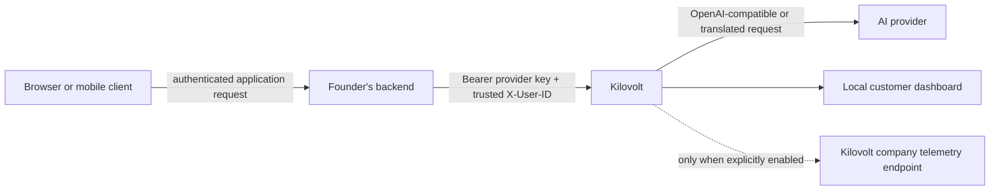
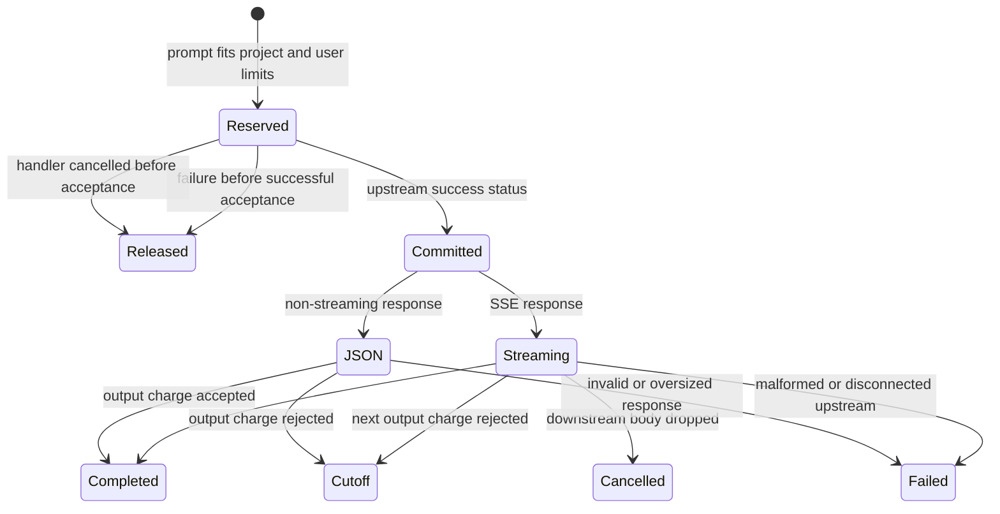

# Architecture

Kilovolt is a single-process reverse proxy between an authenticated application
backend and an upstream chat-completions provider. One self-hosted process is one
implicit application project.

## Trust and request flow

The founder's backend is the identity boundary. Kilovolt does not authenticate
end users and must not accept an arbitrary `X-User-ID` directly from an
untrusted browser or mobile client.

## Proxy lifecycle

1. Validate `Authorization` and `Content-Type`.
2. Read at most `KILOVOLT_MAX_REQUEST_BODY_BYTES`.
3. Parse the supported chat-completions fields and estimate prompt tokens.
4. Check optional token gates.
5. Atomically reserve the calculated prompt cost against both the project and
   user accounts.
6. Send the request upstream and wait no longer than
   `KILOVOLT_UPSTREAM_HEADER_TIMEOUT_SECONDS` for response headers.
7. Release the prompt reservation for a connection failure, header timeout, or
   upstream non-success response.
8. Commit the prompt reservation after a successful upstream HTTP response.
9. Process the body as bounded SSE when `stream=true`, or bounded JSON when
   `stream=false`.
10. Record local operational statistics when the request finishes.

Normal lifecycle transitions are idempotent. Repeating the same commit or
release succeeds without duplicating money. Conflicting transitions and unknown
request IDs return typed ledger errors.

## Hierarchical financial ledger

The project account, all user accounts, active reservations, and finalized
reservation IDs are protected by one `Mutex<LedgerState>`. A reservation or
output charge computes both prospective totals before changing either account.
If the project check or user check fails, both remain unchanged.

The comparison is `prospective_total > configured_limit`, so a binary-exact
value equal to a limit is allowed. Enforcement currently uses `f64`; decimal
values such as `0.1 + 0.2` can round above `0.3`. A future ledger should use
integer atomic monetary units.

## Streaming response path

The SSE parser accumulates bytes only until a complete event delimiter or
`KILOVOLT_MAX_SSE_FRAME_BYTES`, whichever comes first. It supports LF and CRLF
delimiters, split UTF-8 code points, multiple events in one transport chunk,
events split across many chunks, and a valid final event without a trailing
blank line. Invalid UTF-8, invalid fields, malformed JSON data, or an oversized
frame terminates forwarding and records a `502`.

OpenAI-compatible `choices[].delta.content` text is tokenized per complete SSE
event. Per-event token counts are not identical to tokenizing the complete
answer once because BPE merges can cross provider event boundaries. The tested
case over-counts when split; Kilovolt intentionally keeps this bounded,
conservative approximation. It is not provider-invoice equivalence, and
unsupported tool/function payloads are not currently accounted.

Each output increment is atomically charged before that frame is yielded. A
rejected increment is neither charged nor forwarded. Because application-level
code cannot observe the exact kernel socket write, a parsed and approved frame
may remain charged if the client disconnects between the charge and actual
network delivery. Already committed prompt cost is never refunded after
upstream acceptance.

## Non-streaming response path

`stream=false` requires a successful JSON response no larger than
`KILOVOLT_MAX_UPSTREAM_BODY_BYTES`. Kilovolt uses a non-negative integer
`usage.completion_tokens` when present. Otherwise it tokenizes the complete
supported `choices[].message.content` value once. The JSON bytes are returned
unchanged only after the output charge succeeds. A response whose output charge
would exceed a budget is withheld with `429`; its already-consumed prompt
remains committed.

Gemini translation is streaming-only. A Gemini request with `stream=false` is
rejected before reservation.

## Dashboard and telemetry data paths

The customer dashboard is embedded in the Rust process. `/api/stats` reads the
same in-memory ledger and local request deque used by the proxy. Both dashboard
routes require `KILOVOLT_DASHBOARD_TOKEN`; if it is absent, the routes return
`503`.

Company telemetry is a separate outbound path and is disabled by default.
Enabling it sends explicitly documented aggregate payloads to
`KILOVOLT_TELEMETRY_URL`. The separate Next.js receiver and company telemetry
dashboard do not provide data to the customer dashboard.

## Process and persistence limits

- Financial and token state is in memory and resets on restart.
- Each process has an independent project ledger. Multiple replicas do not
  provide a shared budget and can collectively exceed the intended limit.
- No database, distributed lock, or cloud multi-tenancy is implemented.
- Finalized request IDs remain in memory for the lifetime of the process.
- Optional daily and pipeline token gates do not use the financial ledger's
  atomic reservation model and are weaker under concurrency.
- Recent dashboard history is limited to five records.
